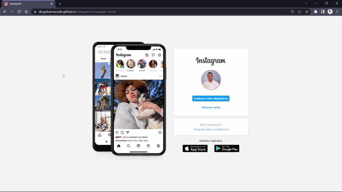

# instagram-homepage-clone
Projeto realizado para o desafio de código Front-end da DIO (Digital Innovation One)
com técnicas de pseudo-classe e responsividade com display-flex e media queries.

#

#
🌐 Click no link para acessar:  [diogobarroscode.github.io/instagram-homepage-clone/](https://diogobarroscode.github.io/instagram-homepage-clone/)
#
## 💻Tecnologias
    - HTML5
    - CSS3
    - JAVASCRIPT

## 💬 Sobre
Para rodar o projeto é só baixar os arquivos e abrir o index.html em algum navegador de internet
ou abrir a pasta no VS Code e executar com o live server.

- HTML
    - Estruturação HTML
    - Tags Semânticas
- CSS
    - Flexbox
    - Pseudo-classes
    - Media querys
    - Respnsividade
- JavaScript
    - Slide animado
#
## 📢 Contato

🌐 [linkedin.com/in/diogobarros-code](https://www.linkedin.com/in/diogobarros-code/)

📧 [diogobarros.code@gmail.com](diogobarros.code@gmail.com)